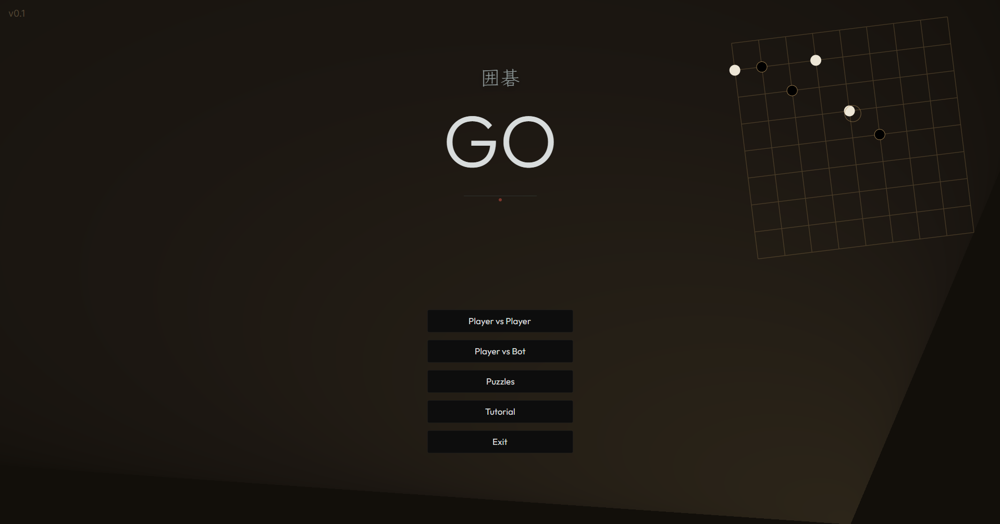
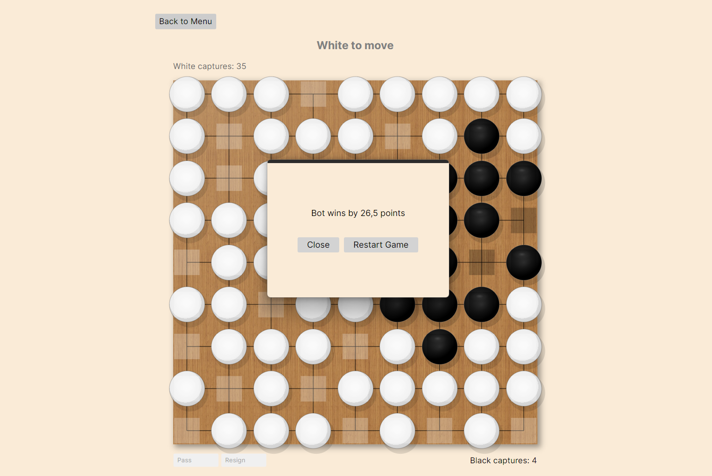
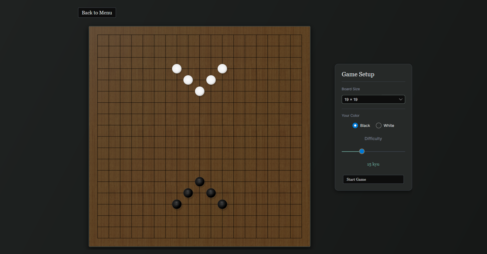
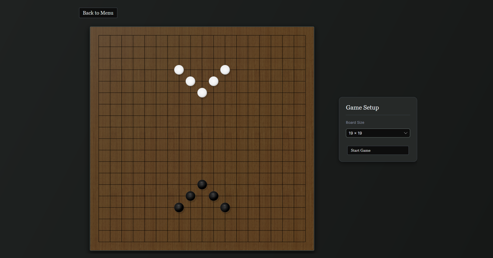

# Go Board Game
This project is a desktop implementation of the traditional board game **Go** written in C# using the modern cross-platform framework **Avalonia UI**.
The application is currently in **Alpha version (v0.4)**.

## 🚀 Main features
* **Local game (1v1):** Ability to play on one computer against another player.
* **Play against AI (KataGo):** Integration with one of the best open-source Go engines.
* **Puzzles:** Includes tsumego problems sourced from [gogameguru/go-problems](https://github.com/gogameguru/go-problems) to sharpen your tactical skills at various difficulty levels.
* **Tutorial:** Step-by-step introduction covering core Go fundamentals (liberties, capture, two eyes, and ko rule) designed specifically for beginners.
* **Game Settings:** A curated collection of Go problems (life and death, tsumego) to sharpen your tactical skills at various difficulty levels.
    * Choice of game board size (standard 19x19, 13x13, 9x9).
    * Choice of stone color (black/white) when playing against a bot.
    * Setting the level/difficulty of the KataGo bot. 
* **Scoring:** Japanese territory scoring rules. The calculation of the final score is delegated directly to the KataGo engine, ensuring accurate determination of territory and dead stones.

## 🛠️ Technologies used
* **Language:** C#
* **GUI Framework:** [Avalonia UI](https://avaloniaui.net/) (XAML / MVVM)
* **Engine:** [KataGo](https://github.com/lightvector/KataGo)

---
## 📸 Screenshots
| Home | Results |
| :---: | :---: |
|  |  |
| PvE mode | PvP mode |
|  |  |

---

## 📢 Project Overview & Status

**Current Version: Alpha (v0.4)** As an early alpha release, it provides a playable experience while continuing to refine underlying systems and feature implementations.
### For developers and contributors:
You are welcome to modify, fork, or optimize this code. Please keep the following in mind:
* **All modifications and execution of the code are at your own risk.**
* Due to early-stage bugs, it is recommended to **thoroughly inspect and test** the code before deployment or further development.


---
 
## ⚙️ How to start a project
1. Clone the repository.
 ```bash
git clone https://github.com/Zero89-sys/Go-BoardGame
```
2. **Important step for playing against bot:** Due to GitHub's file size limits, the trained neural network for KataGo is not included in the repository.
    * Download any network model (`.bin.gz` file) from the official KataGo website.
    * Name the downloaded file exactly `KataGo.bin.gz`.
    * Put it in the `Engine/` folder next to the executable program.
3. Open the project in the IDE and run the application.

## 📄 License
Distributed under the GPL-3.0 license. See `LICENSE` for more information.